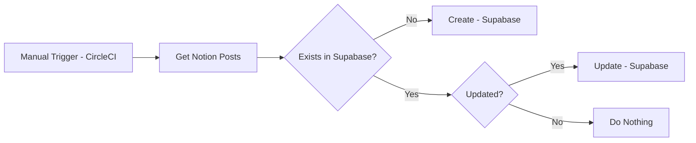

# Deshiknaves Blog Datasource

This repository has a script that will get all the blog posts from Notion and then create entires in Supabase if they have changed. This will run entirely in a CI pipeline on CircleCI.

